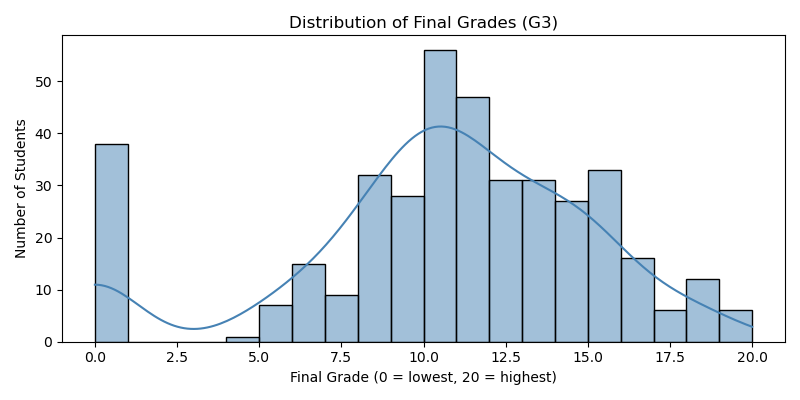
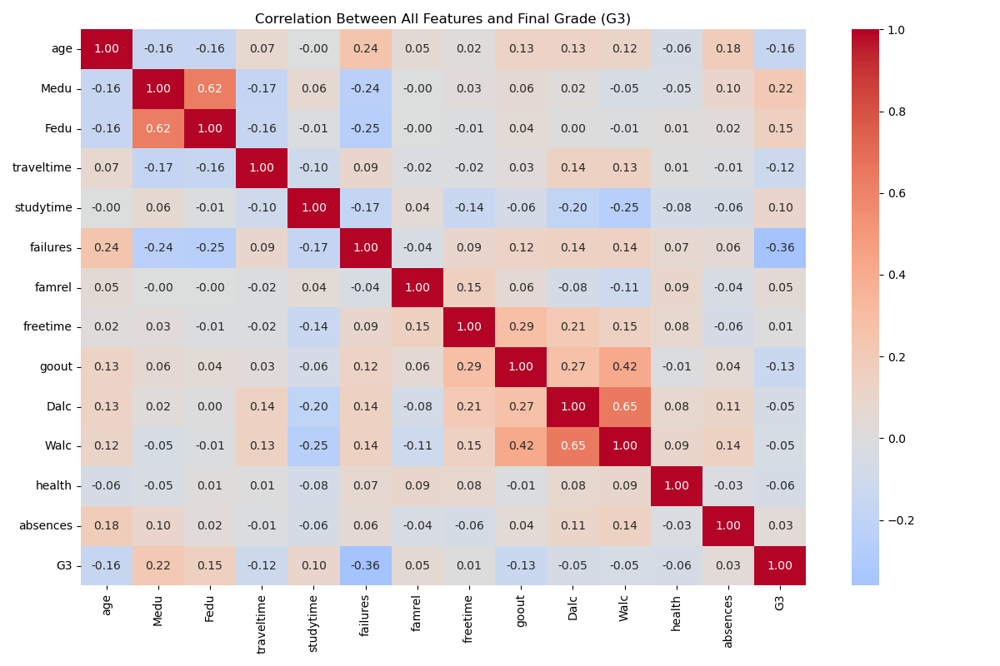
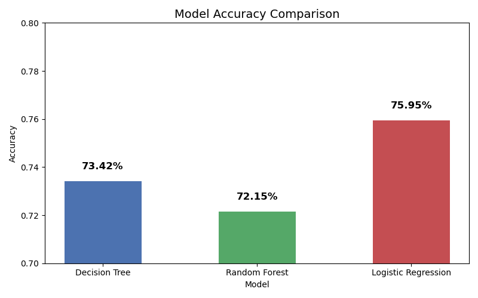
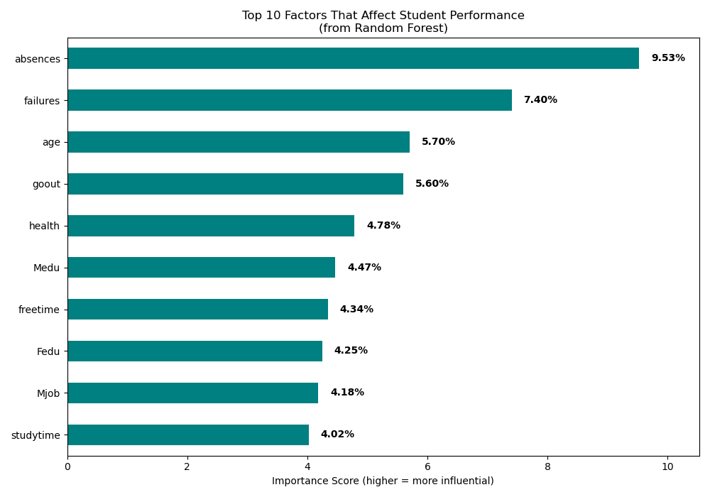

# Student Performance Prediction Using Machine Learning

## Project Overview

This project uses Machine Learning techniques to predict whether a student will pass or fail based on academic, social, and lifestyle-related factors.

The analysis was performed using Python and several machine learning models including:

- Decision Tree
- Random Forest
- Logistic Regression

The project focuses not only on prediction accuracy but also on identifying the major factors that influence student performance.

---

# Business / Real-World Problem

Educational institutions often struggle to identify students who are academically at risk before final examinations.

This project demonstrates how machine learning can help schools:

- Detect students likely to fail
- Understand the factors affecting academic performance
- Support early intervention strategies
- Improve student success rates

---

# Objectives

The main objectives of this project were:

- Analyze student performance data
- Identify factors affecting final grades
- Build classification models to predict pass/fail outcomes
- Compare machine learning model performance
- Visualize insights for better understanding

---

# Dataset Information

The dataset contains information about students including:

- Demographic details
- Family background
- Study habits
- Social activities
- Alcohol consumption
- Attendance
- Previous academic performance

### Dataset Size
- Rows: 395
- Columns: 33

### Target Variable
A new binary target variable called `pass` was created:

- Pass = Final Grade (G3) ≥ 10
- Fail = Final Grade (G3) < 10

---

# Technologies and Libraries Used

## Programming Language
- Python

## Libraries
- Pandas
- NumPy
- Matplotlib
- Seaborn
- Scikit-learn

---

# Project Workflow

## 1. Data Loading and Exploration

The dataset was loaded using Pandas and explored to understand:

- Dataset size
- Column structure
- Missing values
- Statistical summaries

---

## 2. Exploratory Data Analysis (EDA)

Several visualizations were created to understand relationships between variables and student performance.

### Visualizations Included
- Final Grade Distribution
- Pass vs Fail Count
- Study Time vs Grades
- Past Failures vs Grades
- Absences vs Grades
- Correlation Heatmap

---

## 3. Data Preprocessing

Before training the models:

- Text columns were converted into numerical values using Label Encoding
- A binary target variable (`pass`) was created
- Irrelevant columns were removed
- Data was split into training and testing datasets

### Why G1 and G2 Were Removed
The earlier grades (G1 and G2) were excluded because they are highly correlated with the final grade (G3). Including them would make the prediction unrealistically easy and reduce real-world usefulness.

---

# Machine Learning Models Used

## 1. Decision Tree Classifier
A tree-based model that predicts outcomes through a series of decision rules.

### Accuracy
73.42%

---

## 2. Random Forest Classifier
An ensemble learning model using multiple decision trees to improve prediction stability.

### Accuracy
72.15%

---

## 3. Logistic Regression
A statistical classification model that predicts the probability of a student passing or failing.

### Accuracy
75.95%

### Best Performing Model
Logistic Regression achieved the highest overall accuracy.

---

# Model Performance Comparison

| Model | Accuracy |
|---|---|
| Decision Tree | 73.42% |
| Random Forest | 72.15% |
| Logistic Regression | 75.95% |

---

# Key Findings and Insights

The analysis showed that the following factors had the strongest impact on student performance:

- Absences
- Past failures
- Age
- Social outings
- Health condition
- Parent education level
- Study time

### Major Insight
Students with:
- Higher absences
- More past failures
- Lower study time

were significantly more likely to fail.

---

# Visual Outputs

## Grade Distribution
Shows how final grades are distributed among students.

## Pass vs Fail Analysis
Visual comparison of passing and failing students.

## Feature Importance
Displays the most influential variables affecting predictions.

## Confusion Matrices
Compares actual vs predicted results for all models.

---

# Classification Metrics

The models were evaluated using:

- Accuracy
- Precision
- Recall
- F1-Score
- Confusion Matrix

These metrics provided a deeper understanding of model performance beyond simple accuracy.

---

# Challenges Faced

Some challenges during the project included:

- Converting categorical variables into machine-readable format
- Avoiding data leakage from highly correlated features
- Balancing interpretability and prediction accuracy
- Understanding model evaluation metrics

---

# Future Improvements

Possible future enhancements include:

- Hyperparameter tuning
- Cross-validation
- Handling class imbalance
- Using advanced models such as XGBoost
- Building an interactive dashboard
- Deploying the model as a web application

---

# Screenshots

## Grade Distribution

## Correlation Heatmap

## Accuracy Comparison

## Feature Importance

---

# Conclusion

This project successfully demonstrated how machine learning can be applied to educational analytics to predict student outcomes.

Among the models tested, Logistic Regression achieved the best performance with an accuracy of 75.95%.

The project also highlighted important behavioral and academic factors that influence student success, showing how data analytics can support better educational decision-making.

---

# Author

Kishan Ponda

Aspiring Data Analyst | Supply Chain & Business Analytics | Python | SQL | Machine Learning
